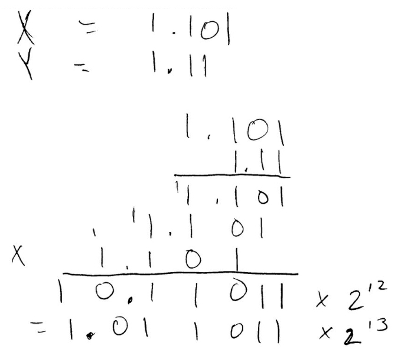

# Computer Architecture - Homework 4

> Connor Finley
>
> 2017/10/21

## 1

> What is the decimal value of the following single-precision floating-point numbers?

### a.

> `1010 1101 0001 0100 0000 0000 0000 0000`

`1` `01011010` `00101000000000000000000`

**Sign** = **1** (negative 1)

**Exponent** = ``0101 1010` ` => 64 + 16 + 8 + 2 = 90

90 - 127 = -37 => $2^{-37}$

**Mantissa/significand** = `00101000000000000000000`

$-1.00101 \times 2^{-37}$

$= -(2^0 + 2^{-3} + 2 ^{-5}) \times 2^{-37}$

$= -(2^{-37} + 2^{-40} + 2 ^{-42})$

$= -8.412825991399586200714111328125e-12$

### b.

> `0100 0110 1100 1000 0000 0000 0000 0000`

`0` `10001101` `10010000000000000000000`

**Sign** = 0 (positive 1)

**Exponent** = `1000 1101` => 128 + 13 = 141

141 - 127 = 14 => $2^{14}$

**Mantissa** = `10010000000000000000000`

$= 1.1001 \times 2^{14}$

$= (2^0 + 2^{-1} + 2^{-4}) \times 2^{14}$

$=  1.5625 \times 2^{14}$

$=25,600$

## 2

> Show the IEEE 754 binary representation for: -75.4 in ...

### a.

> Single precision

75 = $0100 1011$

0.4 * 2 = 0.8

0.8 * 2 = 1.6

0.6 * 2 = 1.2

0.2 * 2 = 0.4

0.4 * 2 = 0.8

$0.0\overline{1100}$

**Mantissa:** $100 1011.0\overline{1100}$

$= 1.00 10110\overline{1100} \times 2^6$

**Exponent** = 6 => 127 + 6 = 133 => `1000 0101`

**Sign** = 1

`1 10000101 00101101100110011001100`

### b.

> Double precision

**Exponent** = 6 => 1023 + 6 = 1029 => `100 0000 0101`

`1 10000000101 0010 110 1100 1100 1100 1100 1100 1100 1100 1100 1100 1100 1100 1`

## 3

> Single-precision float-point numbers x and y are as follows:
>
> x = `1100 0110 1101 1000 0000 0000 0000 0000 `
>
> y = `0011 1110 1110 0000 0000 0000 0000 0000 `

### a.

> x+y

x

sign = 1 (negative)

exponent = `1000 1101` => 141, 141-127 = 14 => $2^{14}$

$x = -1.101 \times 2^{14}$

y

sign = 0 (positive)

exponent = `0111 1101` => 125, 125 - 127 = -2 => $2^{-2}​$

$y = 1.110 \times 2^{-2}$

y has smaller exponent, match x's exponent by increasing by 16

$x = -1.101 \times 2^{14}$

$y = 0.0000000000000001110 \times 2^{14}$

$$-1.1010000000000000000 \\+  0.0000000000000001110\\ -----------\\-1.1010000000000001110$$

$-1.1010000000000001110 \times 2^{14}$

Final result in single precision: `1 10001101 10100000000000011100000`

### b.

> x*y

Add exponents together: -2+14 = 12

$=1.011011 \times 2^{13}$

Add sign

$=-1.011011 \times 2^{13}$

Exponent = 13 => 127 + 13 = 140 => `1000 1100`

Final result: `1 1000 1100 01101100000000000000000`

## 4

> Single precision IEEE 754 floating-point numbers x, y, and z are as follows:
>
> x = `0101 1111 1011 1110 0100 0000 0000 0000 `
>
> y = `0011 1111 1111 1000 0000 0000 0000 0000 `
>
> z = `1101 1111 1011 1110 0100 0000 0000 0000`

### a.

> x + y

x

sign: 0 (positive)

exponent: `1011 1111` = 191, 191-127=64 => $2^{64}$

Significand: `01111100100000000000000`

$1.011111001 \times 2^{64}$

y

sign: 0 

exponent: `0111 1111` = 127 => $2^0$

$1.1111 \times 2^0$

$=1.1111$

Normalize y's exponent by adding 64 to it

$=0.00000000000000000000000000000000000000000000000000000000000000011111 \times 2^{64}$

$$\;\;\;\, 1.01111100100000000000000000000000000000000000000000000000000000000000 \\+  0.00000000000000000000000000000000000000000000000000000000000000011111 \\ ------------------------------------\\\;\;\;\,1.01111100100000000000000000000000000000000000000000000000000000011111$$

$=1.01111100100000000000000000000000000000000000000000000000000000011111 \times 2^{64}$

Precision is truncated.

Final result: `0 10111111 01111100100000000000000`

###  b.

> Result of (a) + z

z = `1101 1111 1011 1110 0100 0000 0000 0000`

sign: 1 (negative)

exponent: `1011 1111` => 191 => $2^{64}$

$-1.011111001 \times 2^{64}$

(a) + z:

$\quad\;\;\; 1.011111001 \\+ -1.011111001$

$=0$

### c.

> Why is the result of (b) counterintuitive?

B's answer is counterintuitive because precision was lost in part a. If there was more precision, part b's answer would equal the value of $y$.

## 5

> IA-32 offers an 80-bit extended precision option with a 1 bit sign, 16-bit exponent, and 63-bit fraction (64-bit significand including the implied 1 before the binary point). Assume that extended precision is similar to single and double precision.

### a.

> What is the bias in the exponent?

Bias: $2^{e-1}-1 = 2^{15}-1 = 32,767$

### b.

> What is the range (in absolute value) of normalized numbers that can be 
>
> represented by the extended precision option?

Exponent ($E$): 1 to 65,534

Fraction ($F$): anything

$(1.F)_2 \times 2^{E-32767}$

**Range:** $1 \times 2^{-32766}$ to $(1.1111...)_2 \times 2^{32767}$

##  6

> Using the refined division hardware, show the unsigned division of:
>
> Dividend = `1101 1001` by Divisor = `0000 1010 `
>
> The result of the division should be stored in the Remainder and Quotient registers. 
>
> Eight iterations are required. Show your steps.

